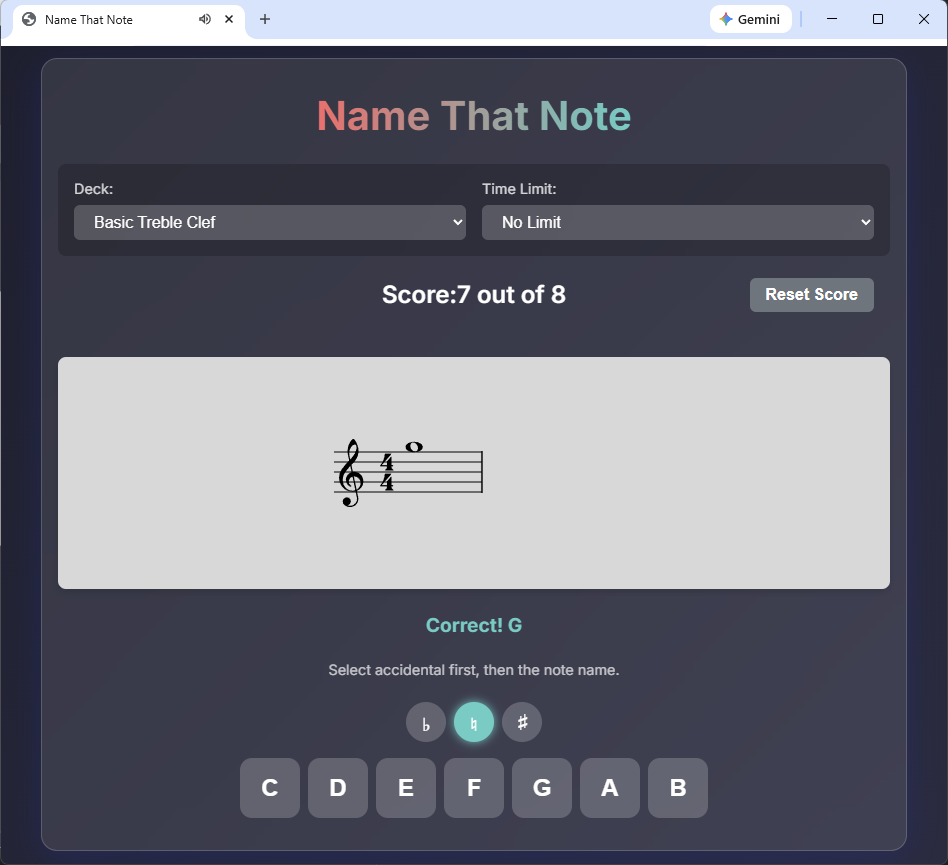

# Name That Note

A web application for music beginners to practice music note naming using flashcards.

This is inspired by the app "Name That Note" by Bamsworld, and https://www.name-that-note.com/. 

This version has a few extra features, such as allowing the user to edit and select their own decks; when the user inputs a correct note, the web app plays the note using the Web Audio API; when an incorrect note is input, the web app plays a sound to indicate the error.



## How to Run

Because this application uses `fetch` to load deck files and the Web Audio API, it must be run on a local web server (opening `index.html` directly in the browser will not work due to CORS policies).

### Option 1: Python (Recommended)
You can use Python's built-in HTTP server. Run the following command in this directory:

```bash
python -m http.server 8000
```

Then open your browser and navigate to: [http://localhost:8000](http://localhost:8000)

### Option 2: VS Code Live Server
If you are using VS Code, install the "Live Server" extension and click "Go Live" at the bottom right.

## Features
- Practice naming notes on Treble and Bass clefs.
- Support for detailed accidentals (Sharps/Flats).
- Customizable timer (5s, 10s, unlimited).
- Score tracking.
- Audio playback of the note.

## Editing Decks
You can create or edit decks in the `decks/` folder. The file format is simple:
```
Title: My Deck
Clef: treble
Notes: C4, D4, E4
```
Supported clefs: `treble` or `bass`.
Notes format: `[Step][Accidental][Octave]`. Example: `C#4`, `Bb3`.

## TODO:
- When showing sharp or flat, inputing notes requires hitting the accidental button first. This is not intuitive. 